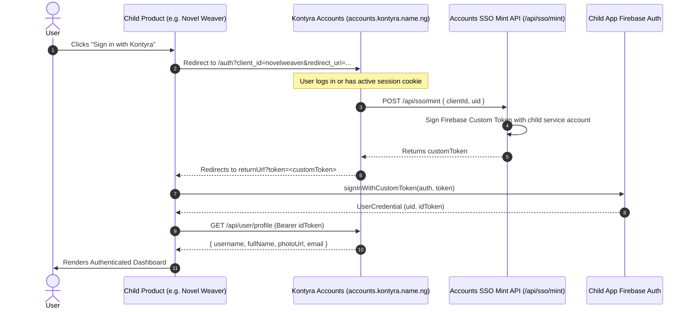
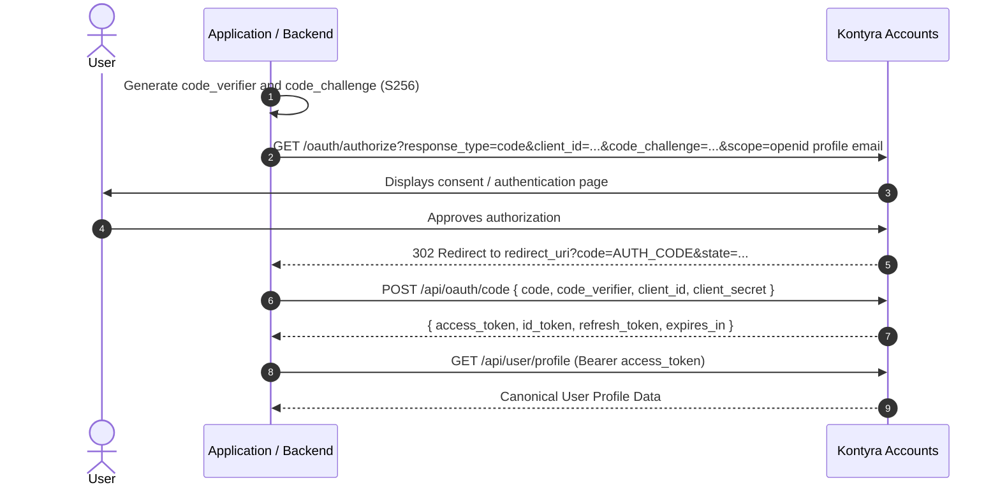

# 01 - Identity, SSO & Authentication Architecture

## 1. Centralized Identity Model

Kontyra uses **Kontyra Accounts** (`https://accounts.kontyra.name.ng`) as its authoritative Identity Provider (IdP). All authentication, credentials, email verification, password resets, session revocation, and multi-factor authentication take place on this platform.

### Principles:
1. **No Local Password Storage**: Sub-applications must never request, hash, or persist user passwords.
2. **Federated Sign-In**: Products consume authentication via OpenID Connect (OIDC) Authorization Code with PKCE or via Firebase Custom Token minting.
3. **Canonical Profile**: Core identity attributes (`uid`, `email`, `username`, `fullName`, `photoUrl`, `isEmailVerified`) belong to Kontyra Accounts.

---

## 2. SSO Authentication Flows

### Flow A: Firebase Custom Token SSO (SPA / Single Page Applications)

Recommended for Vite/React/Next.js client apps utilizing Firebase Client SDK (e.g., DevOS, Novel Weaver, Mini Apps).



#### Child App Implementation (React / TypeScript Example)

```typescript
// Example: src/pages/SSOCallback.tsx or handling returnUrl?token=...
import { useEffect } from 'react';
import { useNavigate, useSearchParams } from 'react-router-dom';
import { getAuth, signInWithCustomToken } from 'firebase/auth';

export function SSOCallback() {
  const [params] = useSearchParams();
  const navigate = useNavigate();
  const token = params.get('token');

  useEffect(() => {
    async function handleToken() {
      if (!token) {
        navigate('/login?error=missing_token', { replace: true });
        return;
      }

      try {
        const auth = getAuth();
        await signInWithCustomToken(auth, token);
        navigate('/dashboard', { replace: true });
      } catch (err) {
        console.error('SSO sign-in error:', err);
        navigate('/login?error=sso_failed', { replace: true });
      }
    }

    handleToken();
  }, [token, navigate]);

  return (
    <div className="flex min-h-screen items-center justify-center bg-black text-white">
      <div className="text-center space-y-4">
        <div className="w-8 h-8 border-2 border-white/20 border-t-white rounded-full animate-spin mx-auto" />
        <p className="text-sm text-neutral-400">Authenticating with Kontyra Identity...</p>
      </div>
    </div>
  );
}
```

---

### Flow B: OAuth 2.0 + OIDC with PKCE (Standard Web & Third-Party Integrations)

For server-rendered applications, CLI utilities, and third-party partner integrations.



---

## 3. Profile Hydration Standard

Sub-applications must periodically or upon initial authentication refresh user profile data from the centralized API.

### Central Profile Endpoint
- **URL**: `https://accounts.kontyra.name.ng/api/user/profile`
- **Method**: `GET`
- **Headers**: `Authorization: Bearer <ID_TOKEN_OR_ACCESS_TOKEN>`
- **Response Format**:
```json
{
  "success": true,
  "user": {
    "uid": "usr_991823ab",
    "email": "developer@kontyra.name.ng",
    "isEmailVerified": true,
    "username": "rayben",
    "fullName": "Ray Ben",
    "photoUrl": "https://accounts.kontyra.name.ng/avatars/rayben.png",
    "createdAt": "2026-08-20T10:00:00.000Z",
    "updatedAt": "2026-10-02T15:20:00.000Z"
  }
}
```

---

## 4. Session & Token Expiry Policy

| Artifact | Expiry | Storage Recommendation | Refresh Mechanism |
| :--- | :--- | :--- | :--- |
| **Firebase ID Token** | 1 Hour | Memory / Firebase SDK Cache | Automatic background refresh via `user.getIdToken(true)` |
| **Custom Token** | 1 Hour (Single Use) | Never stored; exchanged immediately | Discarded after `signInWithCustomToken` |
| **OAuth Access Token** | 1 Hour | HTTP-only cookie or encrypted server session | Reissued using `refresh_token` |
| **OAuth Refresh Token** | 30 Days | Secure HTTP-only cookie with Path restriction | Replaced upon revocation or rotation |

---

## 5. Logout & Account Recovery Rules

1. **Local Logout vs. Global Logout**:
   - Local logout: Clears product session/tokens and redirects to the product public landing page.
   - Global logout: Product redirects to:
     `https://accounts.kontyra.name.ng/auth/logout?return_to=https://<product-domain>/`
2. **Account Recovery & Password Resets**:
   - Sub-applications **must not** render password reset forms.
   - Sub-applications must redirect recovery links to:
     `https://accounts.kontyra.name.ng/auth/forgot-password`
3. **Email Verification**:
   - Triggered exclusively through Kontyra Accounts. Sub-apps inspect `isEmailVerified` from the profile and display non-blocking verification alerts if required.
