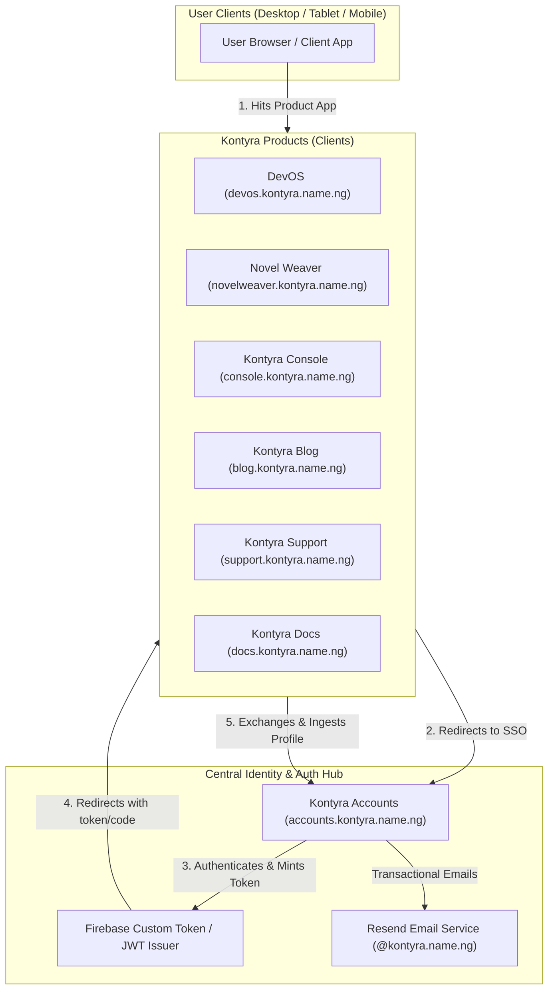

# Kontyra Product Integration Standards

A unified specification for engineering, design, authentication, SSO, email, and layout consistency across the Kontyra product ecosystem.

---

## Ecosystem Architecture Overview

The Kontyra ecosystem operates as an interconnected suite of developer tools, creative platforms, and cloud utilities anchored around a single centralized Identity Provider (**Kontyra Accounts**).



---

## Directory Index

| Document | Scope |
| :--- | :--- |
| [01 - Identity, SSO & Auth Flow](./01-identity-and-sso.md) | Centralized SSO, OpenID Connect / OAuth 2.0 PKCE, Firebase Custom Token exchange, session lifecycle, and sign-out standards. |
| [02 - Navigation & Application Layouts](./02-layout-and-navigation.md) | Header (`56px`), Drawer/Sidebar, Footer, Public / Auth / App layouts, breakpoints, and states. |
| [03 - Email & Transactional Notifications](./03-email-and-notifications.md) | Resend provider configuration, sender aliases, approved template structures, and security rules. |
| [04 - Brand Tokens & UI Foundations](./04-brand-tokens-and-ui.md) | Design tokens, color system, typography scale, borders, blurs, and surface glassmorphism. |
| [05 - Product Integration Guide & Checklist](./05-product-integration-guide.md) | Step-by-step developer onboarding guide for creating or integrating a new product into the Kontyra suite. |
| [06 - Environment Configuration Template](./06-example-env-template.md) | Standard environment variable template with zero secret leaks. |

---

## Non-Negotiable Core Tenets

1. **Zero Credential Duplication**: Product databases **must never** store passwords, create independent password fields, or handle primary password reset workflows. All credentials reside exclusively in `accounts.kontyra.name.ng`.
2. **Centralized User Hydration**: Products must hydrate user identity (display name, unique username, avatar, email verification state) from Kontyra Accounts via the central profile endpoint:
   ```
   GET https://accounts.kontyra.name.ng/api/user/profile
   Authorization: Bearer <ID_TOKEN>
   ```
3. **Unified Navigation Standard**: Every product must have a top bar fixed at `56px` height, featuring the Kontyra brand emblem, contextual product badge, universal app switcher, and user account avatar with unified dropdown.
4. **Universal Design Language**: Dark-first palette (`#000000`, `#0A0A0A`, `#141414`), subtle high-contrast borders (`rgba(255, 255, 255, 0.08)` to `0.15`), and backdrop blur (`backdrop-blur-xl` / `backdrop-blur-md`).
